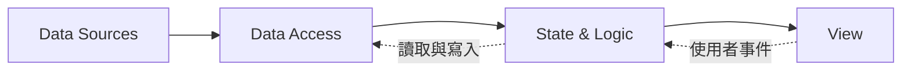

以可獨立測試的 View 為目標，依照以下架構規則設計或審查前端程式。允許替換渲染框架與資料來源，不指定狀態管理工具或各層的具體實作形式。

View 能單獨測試時，可以得到以下好處：

- 測試只要準備 view data、操作畫面、檢查畫面內容與送出的事件，不必 mock 資料層或網路請求，寫起來快，也不會偶爾莫名其妙失敗。
- 要測空清單、超長文字、缺欄位這類少見情況，直接改 view data 就好。
- 如果測試時發現非得 mock API 才跑得起來，代表商業邏輯跑進了 View，可以及早發現。
- View 不綁資料來源，可以直接放進 Storybook 或畫面比對工具。之後換掉 API 串接方式或狀態管理工具，View 的測試不用改，還能幫忙擋住改壞的地方。

## 架構層

### 維持單向依賴

依照以下四層安排資料流：



功能資料與讀寫行為只能沿實線箭頭方向傳遞：

- View 的功能資料，也就是畫面要顯示或送出的那些業務資料，只能由上層以 view data 傳進來。View 不可以自己呼叫 Data Access 取得資料，也不可以直接去 store、context 等共用位置讀取業務狀態，無論那份狀態是整個應用程式共用，還是只在同一個功能模組內共用。
  - 只影響外觀、和業務資料無關的東西不算功能資料，View 可以直接使用：渲染框架本身、design system 元件，以及 theme、語系、文字方向（由左至右或由右至左）這類整個應用程式共用的呈現設定。
- State & Logic 只能依賴 Data Access 提供的介面。
- Data Access 只能依賴資料來源。
- 若實作需要違反上述規則，說明違反哪一條規則、無法遵守的原因，以及影響範圍。

### 保持 View 可獨立測試

- 允許 View 根據 view data 與 Local Client State 執行沒有副作用的呈現運算，例如條件呈現、將 array 映射成畫面元素、組合 CSS class，以及計算 accessibility attributes。
- 不要在 View 中取得外部資料、將 API response 正規化成 view data，或判斷權限、價格與狀態轉換等商業規則。
- 讓 View 在使用者操作後送出代表使用者意圖的事件。依照目標框架的慣例實作事件傳遞機制。
- 測試 View 時，提供 view data、操作 View，並驗證畫面結果與送出的事件。不要連接或 mock Data Access、網路請求、應用程式全域狀態或其他功能模組。
- 若 View 使用 theme、語系等共用呈現設施，允許測試使用固定的 wrapper 提供相同環境。wrapper 不得載入功能狀態或資料存取邏輯。
- 若測試仍需要功能資料或呈現設施以外的依賴，說明該依賴的必要性，以及為何無法維持 View 的依賴規則。

判斷一段運算應放在哪一層：

- 運算只決定資料如何顯示，而且相同的明確輸入會產生相同結果時，可以留在 View 或抽成呈現層的純函式。
- 以下工作由 State & Logic 處理：
  - 依商業規則計算狀態、價格或操作權限。
  - 合併多個資料來源的結果。
- 日期、金額與文字的格式化屬於呈現邏輯，可以抽成共用函式供多個 View 使用。若結果會受語系、時區或目前時間影響，應明確傳入這些條件，或透過可在測試中指定的共用設定提供。

### 劃分各層職責

- State & Logic 管理狀態與商業規則、執行非同步操作，並透過 Data Access 讀寫資料。
- Data Access 封裝 REST、GraphQL、WebSocket、localStorage 等資料來源，並處理資料來源特有的結構，例如移除 response 外層、轉換欄位名稱與解析日期，使 State & Logic 不依賴特定通訊方式或儲存機制。
- 資料轉換不需要目前狀態或商業規則時，Data Access 可以直接回傳 view data。需要套用商業規則、合併目前狀態或組合多個資料來源時，由 State & Logic 產生 view data。
- 無論轉換放在 Data Access 或 State & Logic，都將轉換邏輯寫成純函式，讓測試可以直接提供輸入並驗證輸出。
- 依照目標框架的慣例，加入負責串接 View 與 State & Logic 的整合程式。

### 設計時辨識不同類型的狀態

設計前端功能時，確認是否包含以下五類狀態，再依各類狀態的使用範圍與同步需求選擇管理方式：

| 類型 | 包含的狀態 |
| --- | --- |
| URL                 | 路由參數與 query string 等可分享、可加入書籤的狀態 |
| Server State        | 來自遠端且需要同步，可能需要快取的狀態             |
| Global Client State | 整個應用程式共用的前端狀態                         |
| Shared Client State | 同一功能模組內多個 View 或元件共用的前端狀態       |
| Local Client State  | 只影響單一 View 或元件互動的暫時狀態               |

不要由這套架構指定 Redux、Zustand 或其他狀態管理工具，也不要規定各類狀態必須由哪一種工具管理。

Local Client State 表示狀態的使用範圍，只影響單一 View 或元件。複雜互動狀態表示狀態之間有多個轉換條件，兩者可以重疊。例如，多步驟表單與拖放（drag-and-drop）操作都可以屬於 Local Client State。這套架構只要求辨識它的使用範圍，不規定步驟、驗證與返回流程，或拖曳中、可放置位置與放置完成等狀態要如何轉換。

### 保留實作選擇

- 允許 State & Logic 由單一單元或多個單元組成。
- Local Client State 可以採用 controlled、uncontrolled，或其他符合目標框架慣例的形式。
- 不使用這套架構規定 State & Logic 或 Data Access 的測試方式。

## 元件 interface 慣例

### 將業務資料與其他 props 分開

元件應依照自身的呈現需求定義資料欄位，不要直接接收後端 API 回傳的完整資料結構。這能避免 API 新增、移除或重新命名無關欄位時，連帶影響元件使用介面。

將畫面需要呈現的業務資料放進一個具名物件。事件、顯示設定與外層元素設定仍留在元件 props 的外層。

#### Example：文章卡片

```typescript
type ArticleCardProps = {
  article: {
    title: string;
    description: string;
    creatorName: string;
    publishedAt: Date;
  };
  className?: string;
  onClick?: () => void;
  showBookmarkButton?: boolean;
  showPublishDate?: boolean;
};
```

`article` 只包含文章卡片需要呈現的資料，不等同於後端文章 API 回傳的完整資料。`className`、`onClick`、`showBookmarkButton` 與 `showPublishDate` 分別負責外層樣式、使用者事件與顯示設定，因此保留在外層。

具名物件應直接說明資料內容，例如 `article`、`account` 或 `address`。不要使用 `data`、`config` 或 `options` 等無法看出內容的名稱。

### 使用通用命名慣例

- boolean 使用 `is`、`has`、`should` 或 `show` 前綴。名稱本身已是形容詞時，不加 `is`，例如 `disabled`。
- 建立資料物件或函式的輔助函式使用 `make` 前綴，不要使用 `create` 前綴。

### 依目標框架改寫名稱與語法

依照目標框架的慣例調整名稱與語法，但不要改變資料內容、事件意圖或依賴方向。

#### React

- 呼叫元件時傳入的事件處理函式使用 `on` 前綴，並表達使用者意圖，例如 `onCheckout`。
- 內部事件處理函式使用 `handle` 前綴，例如 `handleCheckout`。不要用 `on` 前綴命名內部處理函式。
- render props 使用名詞加上 `Render` 後綴，例如 `descriptionRender`。
- 實際使用 React Hooks 的函式可以命名為 `useCart`。一般的資料轉換函式不要加上 `use` 前綴。
- 在 styled-components 中，如果 prop 只用來決定 CSS，傳給 styled component 時加上 `$` 前綴，避免它被傳到 HTML 元素。元件對外仍使用原本的 prop 名稱。

```tsx
type HeaderProps = {
  showHeader: boolean;
};

const StyledHeader = styled.header<{ $showHeader: boolean }>`
  display: ${({ $showHeader }) => ($showHeader ? "block" : "none")};
`;

function Header({ showHeader }: HeaderProps) {
  // 對外介面不暴露 styled-components 專用的 `$` 前綴。
  // `$showHeader` 不會被 styled-components 傳到 HTML 元素。
  return <StyledHeader $showHeader={showHeader} />;
}
```

#### Vue

- 元件送出 `checkout` event，並在 template 中使用 `@checkout`。
- 使用 Composition API 的 composable 可以命名為 `useCart`。一般的資料轉換函式不要加上 `use` 前綴。
- Vue 的 prop 名稱在 `<script>` 中使用 camelCase。Single-File Component 的 template 可以使用 camelCase 或 kebab-case，但同一個專案應維持一致。template 如果直接寫在 HTML 中，瀏覽器會將 attribute 名稱轉成小寫，因此必須使用 kebab-case。

```vue
<!-- PageHeader.vue -->
<script setup lang="ts">
// prop 宣告使用 camelCase。
defineProps<{ showHeader: boolean }>();
</script>
```

```vue
<!-- 呼叫 PageHeader 的 template 使用 kebab-case。show-header 對應 showHeader prop。 -->
<PageHeader :show-header="showHeader" />
```

#### Angular

- 元件將事件宣告為 `checkout` output，並在 template 中使用 `(checkout)`。

### 參考依據

- [React：Reusing Logic with Custom Hooks](https://react.dev/learn/reusing-logic-with-custom-hooks) 規定 Hook 名稱使用 `use`，也說明不呼叫 Hook 的一般函式不應使用此前綴。
- [React：Responding to Events](https://react.dev/learn/responding-to-events) 說明元件接收的事件 prop 使用 `on`，內部事件處理函式通常使用 `handle`。
- [Vue：Composables](https://vuejs.org/guide/reusability/composables.html) 說明 composable 的 `use` 命名、呼叫位置與 stateful logic 範圍。
- [Vue：Component Events](https://vuejs.org/guide/components/events) 說明 emitted event 與 template listener 的命名及大小寫轉換。
- [Vue：Props](https://vuejs.org/guide/components/props.html#prop-name-casing) 說明 prop 宣告與 template 使用位置的大小寫規則。
- [Angular：Custom events with outputs](https://angular.dev/guide/components/outputs) 明確要求 output 使用 camelCase，並避免 `on` 前綴。
- [styled-components：Transient props](https://styled-components.com/docs/api#transient-props) 說明 `$` 前綴用來阻止 style-only prop 傳到底層 React node 或 DOM。
